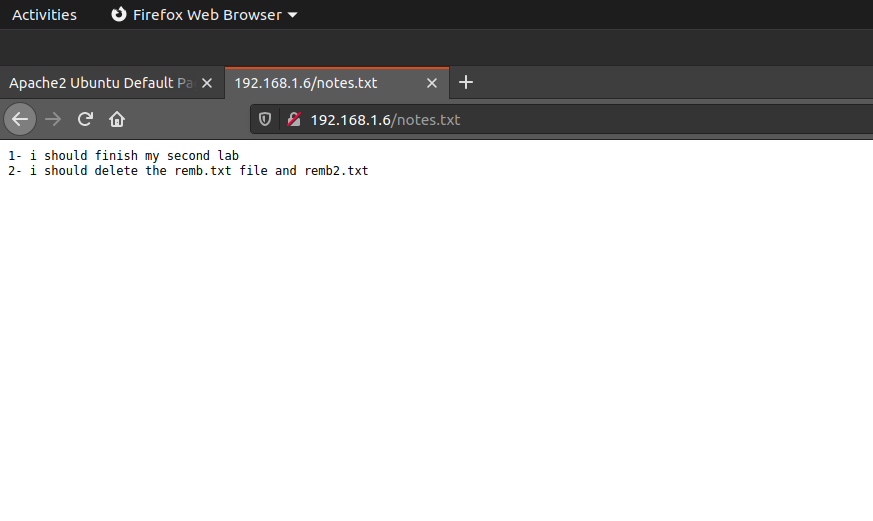
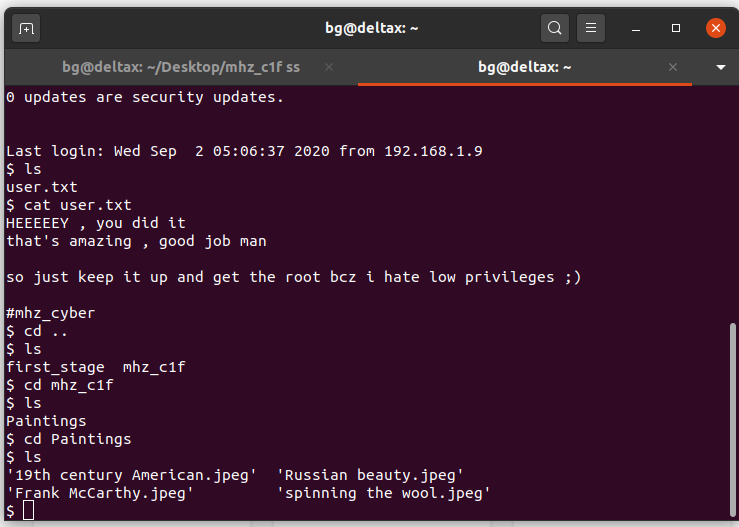

# mhz_cxf-c1f-Vulnhub-Walkthrough
mhz_cxf: c1f Vulnhub Walkthrough

**Description**
A piece of cake machine
You will learn a little about enumeration/local enumeration , steganography.
This machine tested on Virtualbox , so i'm not sure about it with Vmware
This works better with VirtualBox rather than VMware.

***Name: mhz_cxf: c1f***
***Date release: 24 Apr 2020***
***Author: mhz_cyber & Zamba***
***Series: mhz_cxf***

So let's begin hacking!!
**Step 1: Scan the machine**
> nmap -A -p- <IP_address_of_your_machine>

From the scan we can see that, port 22 and 80 are open. Let's explore port 80.

**Step 2: Go to machine's IP in web browser**

This doesn't help us much! Let's try bruteforcing the IP with dirb.

**Step 3: Bruteforce the IP with dirb**

> dirb http://<IP_address_of_your_machine> -X .txt

We are looking only for files containing .txt extension

From this step we got a file called notes.txt, let's take a look at the page.
>http://<IP_address_of_your_machine>/notes.txt

From this we came to know that there are two files remb.txt and remb2.txt

**Step 4: Take a look at remb.txt file**

> http://<IP_address_of_your_machine>/remb.txt

It looks like we should try ssh'ing in next step from the text file data.(port 22 was open right XD )

**Step 5: SSH into the machine**

> ssh first_stage@<IP_address_of_your_machine>

when it prompts to enter password, enter this

>flagitifyoucan1234

And yes! we are successful to ssh into the machine, let's explore the machine! I wonder what and all it can have!!

**Step 6: Explore the machine**

And that's it! We are halfway done.. now try to be root and complete the machine!!

**Step 7: Explore a little bit more**

It looks like suspicious about the Paintings! isn't it?
Let's download and take a closer look at the paintings.

**Step 8 : Download the Paintings**

I'm here making a new folder which contains all the Paintings.
